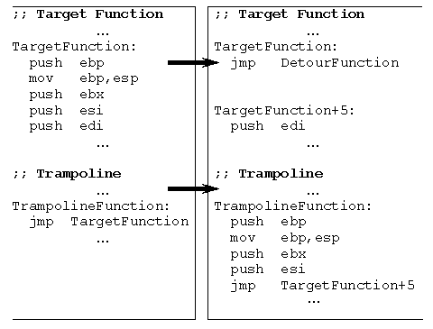

Interception of Binary Functions
================================

The Detours library enables interception of function calls. Interception
code is applied dynamically at runtime. Detours replaces the first few
instructions of the *target function* with an unconditional jump to the
user-provided *detour function*. Instructions from the target function
are preserved in a *trampoline function*. The trampoline consists of the
instructions removed from the target function and an unconditional
branch to the remainder of the target function.

When execution reaches the target function, control jumps directly to
the user-supplied detour function. The detour function performs whatever
interception *preprocessing* is appropriate. The detour function can
return control to the *source* function or it can call the trampoline
function, which invokes the target function without interception. When
the target function completes, it returns control to the detour
function. The detour function performs appropriate *postprocessing* and
returns control to the source function. Figure 1 shows the logical flow
of control for function invocation with and without interception.

------------------------------------------------------------------------

###### Figure 1. Control flow of invocation without Detours and with Detours.

------------------------------------------------------------------------

The Detours library intercepts target functions by rewriting their
in-process binary image. For each target function, Detours actually
rewrites two functions, the target function and the matching trampoline
function, and one function pointer, the target pointer. The trampoline
function is allocated dynamically by Detours. Prior to insertion of a
detour, the trampoline contains only a single jump instruction to the
target function. After insertion, the trampoline contains the initial
instructions from the target function and a jump to the remainder of the
target function.

The *target pointer* is initialized by the user to point to the target
function. After a detour is attached to the target function, the target
pointer is modified to point to the trampoline function. After the
detour is detached from the target function, the target pointer is
returned to point to the original target function.

------------------------------------------------------------------------

###### Figure 2. Trampoline and target functions, before (on the left) and after (on the right) insertion of the detour.

------------------------------------------------------------------------

Figure 2 shows the insertion of a detour. To detour a target function,
Detours first allocates memory for the dynamic trampoline function (if
no static trampoline is provided) and then enables write access to both
the target and the trampoline. Starting with the first instruction,
Detours copies instructions from the target to the trampoline until at
least 5 bytes have been copied (enough for an unconditional jump
instruction). If the target function is fewer than 5 bytes, Detours
aborts and returns an error code.

To copy instructions, Detours uses a simple table-driven disassembler.
Detours adds a jump instruction from the end of the trampoline to the
first non-copied instruction of the target function. Detours writes an
unconditional jump instruction to the detour function as the first
instruction of the target function. To finish, Detours restores the
original page permissions on both the target and trampoline functions
and flushes the CPU instruction cache with a call to the
`FlushInstructionCache` API.
