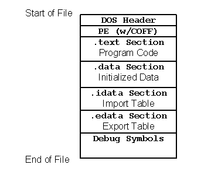
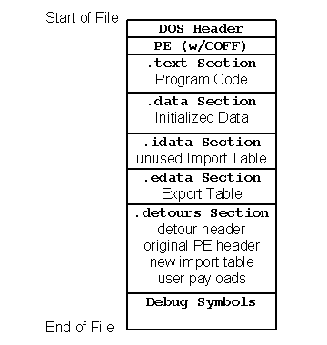

Payloads and DLL Import Editing
===============================

In addition to APIs for attaching and detaching detours functions, the
Detours package also include APIs for attaching arbitrary data segments,
called *payloads*, to Windows binary files and for editing DLL import
tables. The binary editing APIs in Detours are fully reversible; Detours
stores recovery information within the binary to enable removal of the
edits at any time in the future.

------------------------------------------------------------------------

###### Figure 3. Format of a Windows PE binary file.

------------------------------------------------------------------------

Figure 3 shows the basic structure of a Windows Portable Executable (PE)
binary file. The PE format for Windows binaries is an extension of COFF
(the Common Object File Format). A Windows binary consists of a DOS
compatible header, a PE header, a text section containing program code,
a data section containing initialized data, an import table listing any
imported DLLS and functions, an export table listing functions exported
by the code, and debug symbols. With the exception of the two headers,
each of the other sections of the file is optional and may not exist in
a given binary.

------------------------------------------------------------------------

###### Figure 4. Format of a Detours-modified binary file.

------------------------------------------------------------------------

To modify a Windows binary, Detours creates a new `.detours` section
between the export table and the debug symbols, as shown in Figure 4.
Note that debug symbols must always reside last in a Windows binary. The
new section contains a detours header record and a copy of the original
PE header. If modifying the import table, Detours creates the new import
table, appends it to the copied PE header, then modifies the original PE
header to point to the new import table. Finally, Detours writes any
user payloads at the end of the `.detours` section and appends the debug
symbols to finish the file. Detours can reverse modifications to the
Windows binary by restoring the original PE header from the `.detours`
section and removing the `.detours` section. Figure 4 shows the format
of a Detours-modified Windows binary.

Creating a new import table serves two purposes. First, it preserves the
original import table in case the programmer needs to reverse all
modifications to the Windows file. Second, the new import table can
contain renamed import DLLs and functions or entirely new DLLs and
functions. For example, the [setdll.exe](SampleSetdll) program
included in the Detours package, inserts an initial entry for a user's
DLL into a target application binary. As the first entry in the
application's import table, the user's DLL is always the first DLL to
run in the application's address space.

Detours provides APIs for editing import tables
([DetourBinaryEditImports](DetourBinaryEditImports)), adding
payloads ([DetourBinarySetPayload](DetourBinarySetPayload)),
enumerating payloads
([DetourBinaryEnumeratePayloads](DetourBinaryEnumeratePayloads)),
and removing payloads
([DetourBinaryPurgePayloads](DetourBinaryPurgePayloads)).
Detours also provides APIs for enumerating the binary files mapped into
an address space
([DetourEnumerateModules](DetourEnumerateModules)) and locating
payloads within those mapped binaries
([DetourFindPayload](DetourFindPayload)). Each payload is
identified by a 128-bit globally unique identifier (GUID). Payloads can
be used to attach per-application configuration data to application
binaries.

Payloads can be copied directly into a target process using the
[DetourCopyPayloadToProcess](DetourCopyPayloadToProcess) API.
